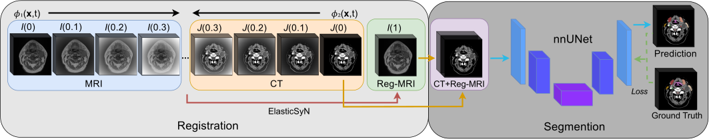
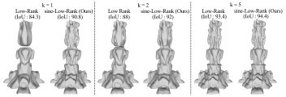
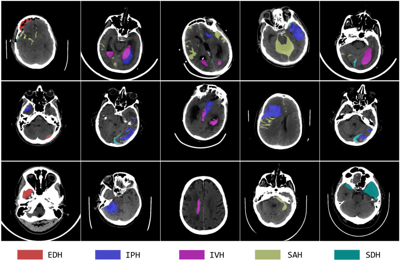

<!--

-->

<h1> Zeyu Zhang </h1>

<!--
[![Homepage](https://img.shields.io/badge/Homepage-555555.svg?style=flat-square&logo=data:image/svg%2bxml;base64,PCFET0NUWVBFIHN2ZyBQVUJMSUMgIi0vL1czQy8vRFREIFNWRyAxLjEvL0VOIiAiaHR0cDovL3d3dy53My5vcmcvR3JhcGhpY3MvU1ZHLzEuMS9EVEQvc3ZnMTEuZHRkIj4KDTwhLS0gVXBsb2FkZWQgdG86IFNWRyBSZXBvLCB3d3cuc3ZncmVwby5jb20sIFRyYW5zZm9ybWVkIGJ5OiBTVkcgUmVwbyBNaXhlciBUb29scyAtLT4KPHN2ZyBmaWxsPSIjZmZmZmZmIiB3aWR0aD0iODAwcHgiIGhlaWdodD0iODAwcHgiIHZpZXdCb3g9IjAgMCAyNCAyNCIgeG1sbnM9Imh0dHA6Ly93d3cudzMub3JnLzIwMDAvc3ZnIiBpZD0iaG9tZS1hbHQtMyIgY2xhc3M9Imljb24gZ2x5cGgiIHN0cm9rZT0iI2ZmZmZmZiI+Cg08ZyBpZD0iU1ZHUmVwb19iZ0NhcnJpZXIiIHN0cm9rZS13aWR0aD0iMCIvPgoNPGcgaWQ9IlNWR1JlcG9fdHJhY2VyQ2FycmllciIgc3Ryb2tlLWxpbmVjYXA9InJvdW5kIiBzdHJva2UtbGluZWpvaW49InJvdW5kIi8+Cg08ZyBpZD0iU1ZHUmVwb19pY29uQ2FycmllciI+Cg08cGF0aCBkPSJNMjEuNzEsMTAuMjlsLTktOWExLDEsMCwwLDAtMS40MiwwbC05LDlhMSwxLDAsMCwwLS4yMSwxLjA5QTEsMSwwLDAsMCwzLDEySDR2OWExLDEsMCwwLDAsMSwxSDhhMSwxLDAsMCwwLDEtMVYxNWExLDEsMCwwLDEsMS0xaDRhMSwxLDAsMCwxLDEsMXY2YTEsMSwwLDAsMCwxLDFoM2ExLDEsMCwwLDAsMS0xVjEyaDFhMSwxLDAsMCwwLC45Mi0uNjJBMSwxLDAsMCwwLDIxLjcxLDEwLjI5WiIvPgoNPC9nPgoNPC9zdmc+)](https://zeyuzhang.webflow.io/) 
  
 
-->
[![Homepage](https://img.shields.io/badge/Homepage-555555.svg?style=flat-square&logo=data:image/svg%2bxml;base64,PCFET0NUWVBFIHN2ZyBQVUJMSUMgIi0vL1czQy8vRFREIFNWRyAxLjEvL0VOIiAiaHR0cDovL3d3dy53My5vcmcvR3JhcGhpY3MvU1ZHLzEuMS9EVEQvc3ZnMTEuZHRkIj4KDTwhLS0gVXBsb2FkZWQgdG86IFNWRyBSZXBvLCB3d3cuc3ZncmVwby5jb20sIFRyYW5zZm9ybWVkIGJ5OiBTVkcgUmVwbyBNaXhlciBUb29scyAtLT4KPHN2ZyBmaWxsPSIjZmZmZmZmIiB3aWR0aD0iODAwcHgiIGhlaWdodD0iODAwcHgiIHZpZXdCb3g9IjAgMCAyNCAyNCIgeG1sbnM9Imh0dHA6Ly93d3cudzMub3JnLzIwMDAvc3ZnIiBpZD0iaG9tZS1hbHQtMyIgY2xhc3M9Imljb24gZ2x5cGgiIHN0cm9rZT0iI2ZmZmZmZiI+Cg08ZyBpZD0iU1ZHUmVwb19iZ0NhcnJpZXIiIHN0cm9rZS13aWR0aD0iMCIvPgoNPGcgaWQ9IlNWR1JlcG9fdHJhY2VyQ2FycmllciIgc3Ryb2tlLWxpbmVjYXA9InJvdW5kIiBzdHJva2UtbGluZWpvaW49InJvdW5kIi8+Cg08ZyBpZD0iU1ZHUmVwb19pY29uQ2FycmllciI+Cg08cGF0aCBkPSJNMjEuNzEsMTAuMjlsLTktOWExLDEsMCwwLDAtMS40MiwwbC05LDlhMSwxLDAsMCwwLS4yMSwxLjA5QTEsMSwwLDAsMCwzLDEySDR2OWExLDEsMCwwLDAsMSwxSDhhMSwxLDAsMCwwLDEtMVYxNWExLDEsMCwwLDEsMS0xaDRhMSwxLDAsMCwxLDEsMXY2YTEsMSwwLDAsMCwxLDFoM2ExLDEsMCwwLDAsMS0xVjEyaDFhMSwxLDAsMCwwLC45Mi0uNjJBMSwxLDAsMCwwLDIxLjcxLDEwLjI5WiIvPgoNPC9nPgoNPC9zdmc+)](https://steve-zeyu-zhang.github.io) 

 
 

<!--
 
-->

<h3> Biography </h3>

Zeyu Zhang is an undergraduate researcher advised by <a href="http://users.cecs.anu.edu.au/~hartley/">Prof. Richard Hartley</a> and <a href="https://mbzuai.ac.ae/study/faculty/ian-reid/">Prof. Ian Reid</a>. He is also a visiting student researcher at MIT CSAIL, working with <a href="https://hcie.csail.mit.edu/stefanie-mueller.html">Assoc. Prof. Stefanie Mueller</a>. He is an incoming research assistant at USC, working with <a href="https://yuewang.xyz/"> Asst. Prof. Yue Wang</a>. His research interests are rooted in computer vision, focusing on generative 3D modeling and AI for health. Specifically, he is dedicated to advancing efficient and high-quality motion and avatar generation, as well as 3D medical imaging segmentation and representation learning. With extensive experience across multiple research disciplines, Zeyu actively explores cutting-edge advancements in both the foundational and applied aspects of artificial intelligence. He also collaborates closely with <a href="https://ha0tang.github.io/">Asst. Prof. Hao Tang</a> (PKU), <a href="https://bohanzhuang.github.io/">Prof. Bohan Zhuang</a> (ZJU), <a href="https://yangyangkiki.github.io/index.html">Dr. Yang Zhao</a> (La Trobe), <a href="https://scholar.google.com/citations?user=NIc4qPsAAAAJ&hl=en">Dr. Minh-Son To</a> (FHMRI), and many others. <b>Zeyu is actively seeking PhD, RA, and internship in the US.</b>

<h3> News </h3>
<b>(07/19/2024)</b> &#127881; Our paper <a href="https://steve-zeyu-zhang.github.io/MotionAvatar/"><b>Motion Avatar</b></a> has been accepted to <a href="https://bmvc2024.org/"><b>BMVC 2024</b></a>! 
<b>(07/02/2024)</b> &#127881; Our paper <a href="https://steve-zeyu-zhang.github.io/MotionMamba/"><b>Motion Mamba</b></a> has been accepted to <a href="https://eccv2024.ecva.net/"><b style="color: OrangeRed;">ECCV 2024</b></a>! 
<b>(06/18/2024)</b> &#127881; Our paper <a href="https://steve-zeyu-zhang.github.io/JointViT/"><b>JointViT</b></a> has been selected as <b style="color: red;">oral presentation</b> at <a href="https://miua2024.github.io/"><b>MIUA 2024</b></a>! 
<b>(05/14/2024)</b> &#127881; Our paper <a href="https://steve-zeyu-zhang.github.io/JointViT/"><b>JointViT</b></a> has been accepted to <a href="https://miua2024.github.io/"><b>MIUA 2024</b></a>! 
<b>(03/13/2024)</b> &#127881; Our paper <a href="https://steve-zeyu-zhang.github.io/MotionMamba/"><b>Motion Mamba</b></a> has been featured in <a href="https://twitter.com/_akhaliq/status/1767750847239262532"><b>Daily Papers</b></a>! 
<b>(02/10/2024)</b> &#127881; Our paper <a href="https://steve-zeyu-zhang.github.io/SegReg/"><b>SegReg</b></a> has been accepted to <a href="https://biomedicalimaging.org/2024/"><b>ISBI 2024</b></a>!

<h3> Selected Publications </h3>

> **Motion Mamba: Efficient and Long Sequence Motion Generation** 
> [**Zeyu Zhang**](https://steve-zeyu-zhang.github.io)\*, [Akide Liu](https://www.linkedin.com/in/akideliu/)\*, [Ian Reid](https://mbzuai.ac.ae/study/faculty/ian-reid/), [Richard Hartley](http://users.cecs.anu.edu.au/~hartley/), [Bohan Zhuang](https://bohanzhuang.github.io/), [Hao Tang](https://ha0tang.github.io/)✉ 
> [_**ECCV 2024**_](https://eccv2024.ecva.net/) 
>       
> 

  
<b>More Publications</b>

> **Motion Avatar: Generate Human and Animal Avatars with Arbitrary Motion** 
> [**Zeyu Zhang**](https://steve-zeyu-zhang.github.io)\*, [Yiran Wang](https://github.com/u7079256)\*, [Biao Wu](https://scholar.google.com/citations?user=Y3SBBWMAAAAJ&hl=en)\*, [Shuo Chen](https://www.linkedin.com/in/shuo-chen-7747a7246/), [Zhiyuan Zhang](https://github.com/Tiooo111), [Shiya Huang](https://github.com/gekelly), [Wenbo Zhang](https://zwbx.github.io/), [Meng Fang](https://mengf1.github.io/), [Ling Chen](https://profiles.uts.edu.au/Ling.Chen), [Yang Zhao](https://yangyangkiki.github.io/)✉ 
> [_**BMVC 2024**_](https://bmvc2024.org/) 
>      
> 

> **JointViT: Modeling Oxygen Saturation Levels with Joint Supervision on Long-Tailed OCTA** 
> [**Zeyu Zhang**](https://steve-zeyu-zhang.github.io), [Xuyin Qi](https://www.linkedin.com/in/xuyin-q-29672524a/), [Mingxi Chen](https://www.linkedin.com/in/mingxi-chen-4b57562a1/), [Guangxi Li](https://github.com/lgX1123), [Ryan Pham](https://www.flinders.edu.au/people/ryan.pham), [Ayub Qassim](https://www.flinders.edu.au/people/ayub.qassim), [Ella Berry](https://www.linkedin.com/in/ella-berry-a2a3aab4/), [Zhibin Liao](https://researchers.adelaide.edu.au/profile/zhibin.liao), [Owen Siggs](https://researchnow.flinders.edu.au/en/persons/owen-siggs-2), [Robert Mclaughlin](https://researchers.adelaide.edu.au/profile/robert.mclaughlin), [Jamie Craig](https://www.flinders.edu.au/people/jamie.craig), [Minh-Son To](https://www.flinders.edu.au/people/minhson.to) 
> [_**MIUA 2024 Oral**_](https://miua2024.github.io/) 
>       
>  

> **SegReg: Segmenting OARs by Registering MR Images and CT Annotations** 
> [**Zeyu Zhang**](https://steve-zeyu-zhang.github.io), [Xuyin Qi](https://www.linkedin.com/in/xuyin-q-29672524a/), [Bowen Zhang](https://www.adelaide.edu.au/directory/b.zhang), [Biao Wu](https://scholar.google.com/citations?user=Y3SBBWMAAAAJ&hl=en), [Hien Le](https://iconcancercentre.com.au/doctor/hien-le), [Bora Jeong](https://www.linkedin.com/in/bora-jeong-5a3177231/), [Zhibin Liao](https://researchers.adelaide.edu.au/profile/zhibin.liao), [Yunxiang Liu](https://www.adelaide.edu.au/directory/yunxiang.liu), [Johan Verjans](https://researchers.adelaide.edu.au/profile/johan.verjans), [Minh-Son To](https://www.flinders.edu.au/people/minhson.to), [Richard Hartley](http://users.cecs.anu.edu.au/~hartley/)✉ 
> [_**ISBI 2024**_](https://biomedicalimaging.org/2024/) 
>        
>  
> 

> **Thin-Thick Adapter: Segmenting Thin Scans Using Thick Annotations** 
> [**Zeyu Zhang**](https://steve-zeyu-zhang.github.io), [Bowen Zhang](https://www.adelaide.edu.au/directory/b.zhang), [Abhiram Hiwase](https://www.nrf.com.au/news/rotem-latest-research), [Feng Chen](https://www.researchgate.net/scientific-contributions/Feng-Chen-2262634351), [Akide Liu](https://www.linkedin.com/in/akideliu/), [Christen Barras](https://jonesradiology.com.au/barras-christen), [Biao Wu](https://scholar.google.com/citations?user=Y3SBBWMAAAAJ&hl=en), [Adam Wells](https://www.dradamwells.com.au/), [Daniel Ellis](https://www.thefrontiersconference.org/daniel-ellis), [Benjamin Reddi](https://www.adelaide.edu.au/directory/benjamin.reddi), [Andrew Burgan](https://www.linkedin.com/in/andrew-burgan-572334108/?originalSubdomain=au), [Minh-Son To](https://www.flinders.edu.au/people/minhson.to), [Ian Reid](https://mbzuai.ac.ae/study/faculty/ian-reid/)✉, [Richard Hartley](http://users.cecs.anu.edu.au/~hartley/)✉ 
> _**Preprint**_ 
>    
> 

> **SegStitch: Multidimensional Transformer for Robust and Efficient Medical Imaging Segmentation** 
> [Shengbo Tan](https://github.com/goblin327), [**Zeyu Zhang**](https://steve-zeyu-zhang.github.io/), [Ying Cai](https://ieeexplore.ieee.org/author/37087137422)✉, [Daji Ergu](https://ieeexplore.ieee.org/author/37085795653), [Lin Wu](https://dblp.org/pid/65/6292.html), [Binbin Hu](https://dl.acm.org/profile/99661184796), [Pengzhang Yu](https://www.researchgate.net/search/researcher?q=Pengzhang+Yu), [Yang Zhao](https://yangyangkiki.github.io/) 
> _**Preprint**_ 
>     
> 

> **Sine Activated Low-Rank Matrices for Parameter Efficient Learning** 
> [Yiping Ji](https://www.linkedin.com/in/yiping-ji-111b97142/)\*, [Hemanth Saratchandran](https://researchers.adelaide.edu.au/profile/hemanth.saratchandran)\*, [Cameron Gordon](https://www.linkedin.com/in/camerondgordon), [**Zeyu Zhang**](https://steve-zeyu-zhang.github.io), [Simon Lucey](https://researchers.adelaide.edu.au/profile/simon.lucey)✉ 
> _**Preprint**_ 
>   
> 

> **XLIP: Cross-modal Attention Masked Modelling for Medical Language-Image Pre-Training** 
> [Biao Wu](https://scholar.google.com/citations?user=Y3SBBWMAAAAJ&hl=en)\*, [Yutong Xie](https://v3alab.github.io/author/yutong-xie/)\*, [**Zeyu Zhang**](https://steve-zeyu-zhang.github.io), [Minh Hieu Phan](https://scholar.google.com/citations?user=gSEw8EsAAAAJ&hl=en), [Qi Chen](https://scholar.google.com/citations?user=OgKU77kAAAAJ&hl=zh-CN), [Ling Chen](https://profiles.uts.edu.au/Ling.Chen), [Qi Wu](http://www.qi-wu.me/)✉ 
> _**Preprint**_ 
>     
> 

> **BHSD: A 3D Multi-class Brain Hemorrhage Segmentation Dataset** 
> [Biao Wu](https://scholar.google.com/citations?user=Y3SBBWMAAAAJ&hl=en), [Yutong Xie](https://v3alab.github.io/author/yutong-xie/), [**Zeyu Zhang**](https://steve-zeyu-zhang.github.io), [Jinchao Ge](https://github.com/jinchaogjc), [Kaspar Yaxley](https://radiopaedia.org/users/kaspar-lewis-yaxley?lang=us), [Suzan Bahadir](https://au.linkedin.com/in/suzan-bahadir-57870416b), [Qi Wu](http://www.qi-wu.me/), [Yifan Liu](https://scholar.google.com/citations?user=ksQ4JnQAAAAJ&hl=zh-CN), [Minh-Son To](https://www.flinders.edu.au/people/minhson.to)✉ 
> [_**MLMI 2023**_](https://sites.google.com/view/mlmi2023) 
>         
> 

> **A Deep Learning Approach to Diabetes Diagnosis** 
> [**Zeyu Zhang**](https://steve-zeyu-zhang.github.io), [Khandaker Asif Ahmed](https://scholar.google.com/citations?user=rUJ9DVAAAAAJ&hl=en), [Md Rakibul Hasan](https://staffportal.curtin.edu.au/staff/profile/view/rakibul-hasan-145a1046/), [Tom Gedeon](https://staffportal.curtin.edu.au/staff/profile/view/tom-gedeon-5e48a1fd/), [Md Zakir Hossain](https://sites.google.com/view/zakirh?pli=1) 
> [_**ACIIDS 2024**_](https://aciids.pwr.edu.pl/2024/) 
>      
> 

<!--
<h3> Research Experience </h3>

<h3> Education </h3>

- _**07.2021 - 06.2025**_ $~~~~~$ Bachelor of Science (Advanced) (Honours), _The Australian National University_
- _**07.2022**_ $~~~~~~~~~~~~~~~~~~~~~~~$ Visiting Student, _Imperial College London_
-->

